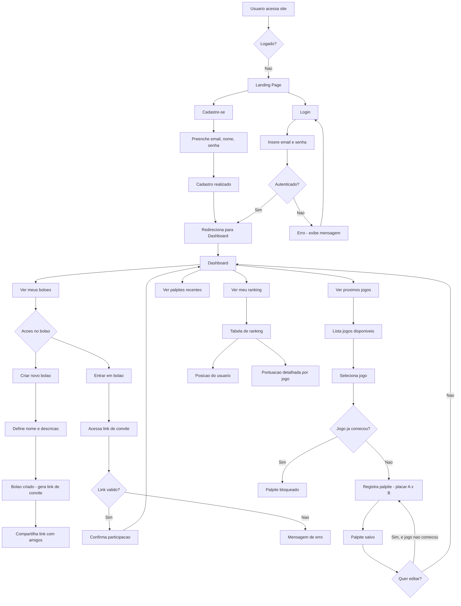
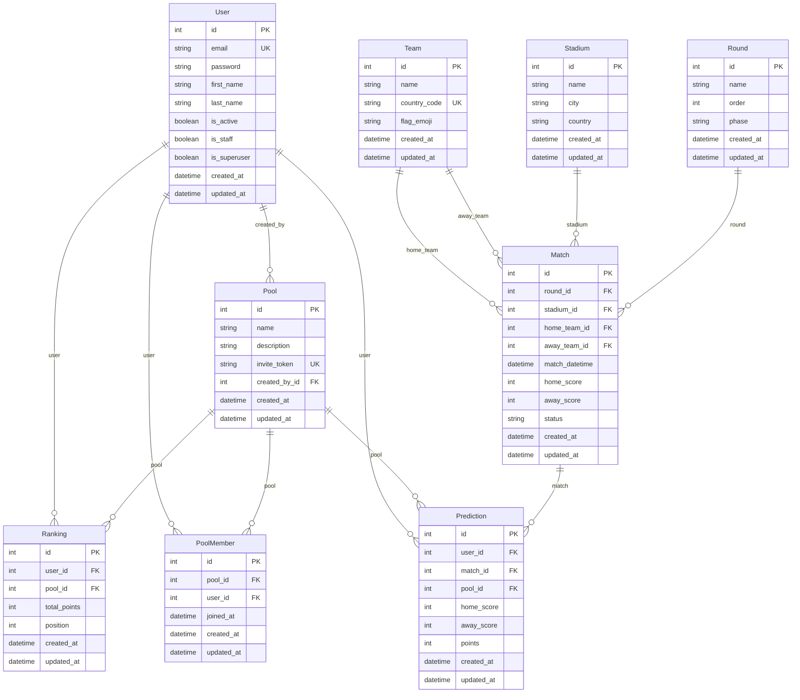

# BolaoCopa - Product Requirement Document (PRD)

---

## 1. Visão geral

O **BolaoCopa** e uma plataforma web de apostas e palpites esportivos voltada para a Copa do Mundo de FIFA. O sistema permite que usuarios se cadastrem, criem ou entrem em boloes, facam palpites nos jogos e acompanhem rankings em tempo real. A plataforma eh construida com Django full stack, utilizando Django Template Language com TailwindCSS para um frontend moderno e responsivo com estetica esportiva premium.

---

## 2. Sobre o produto

O BolaoCopa e um sistema web monolitico construido com Django que permite:

- Cadastro e autenticacao de usuarios via email
- Criacao e gestao de boloes privados com convite por link/token
- Registro de palpites para cada jogo da Copa do Mundo
- Calculo automatizado de pontuacao baseado nos palpites versus resultados reais
- Rankings e classificacoes por bolao

O produto nao exige conhecimento tecnico do usuario e deve funcionar perfeitamente em dispositivos moveis e desktop.

---

## 3. Proposito

Democratizar a experiencia de palpites esportivos para a Copa do Mundo, oferecendo uma plataforma simples, divertida e competitiva onde amigos podem criar boloes, palpitar nos resultados e competir em rankings de pontuacao.

---

## 4. Publico alvo

- **Publico principal:** Torcedores de futebol brasileiros, faixa etaria 18-55 anos, que acompanham a Copa do Mundo e gostam de palpitar sobre resultados com amigos
- **Publico secundario:** Qualquer pessoa que queira participar de boloes esportivos de forma social e competitiva
- **Publico terciario:** Organizadores de boloes informais que buscam uma ferramenta digital para gerenciar seus grupos

---

## 5. Objetivos

### Objetivos de negocio
- Fornecer uma plataforma funcional e estavel para boloes da Copa do Mundo
- Permitir a criacao ilimitada de boloes privados por usuarios cadastrados
- Garantir integridade dos palpites (bloqueio apos inicio do jogo)

### Objetivos de produto
- Interface intuitiva e responsiva com estetica esportiva premium
- Fluxo de cadastro/login simplificado via email
- Dashboard personalizado com visao consolidada dos boloes, palpites e jogos
- Calculo automatizado de pontos via Django signals

### Objetivos tecnicos
- Arquitetura Django monolitica bem organizada em apps separados por dominio
- Codigo limpo seguindo PEP08 com aspas simples
- SQLite como banco de dados para simplicidade inicial
- Class Based Views como padrao para todas as views
- Design system consistente com TailwindCSS e fundo escuro

---

## 6. Requisitos funcionais

### RF-01: Autenticacao de usuarios
- Cadastro com email, nome completo e senha
- Login via email (nao username)
- Logout
- Recuperacao de senha via email
- Perfil do usuario com edicao de dados

### RF-02: Gestao de boloes (Pools)
- Criar bolao com nome e descricao
- Gerar link/token unico de convite
- Listar boloes que o usuario participa
- Listar membros de um bolao
- Sair de um bolao (criador nao pode sair se for o unico admin)
- O criador do bolao eh automaticamente membro

### RF-03: Gestao de palpites (Predictions)
- Listar jogos disponiveis para palpite
- Registrar palpite (placar do time A x placar do time B)
- Editar palpite somente ate o inicio do jogo
- Bloquear palpite apos horario de inicio do jogo
- Visualizar palpites ja realizados
- Visualizar resultado real apos o jogo ser finalizado

### RF-04: Jogos da Copa (Matches)
- Cadastro de selecoes (paises)
- Cadastro de estadios
- Cadastro de rodadas/fases (fase de grupos, oitavas, quartas, semi, final)
- Cadastro de jogos com data/hora, local, selecoes e fase
- Atualizacao do resultado real de cada jogo
- Status do jogo: agendado, em_andamento, finalizado

### RF-05: Rankings e classificacao (Rankings)
- Calculo automatizado de pontos por palpite via Django signal
- Regra de pontuacao:
  - Acerto exato do placar: 3 pontos
  - Acerto do vencedor (ou empate): 1 ponto
  - Erro total: 0 pontos
- Ranking geral do bolao (somatoria de pontos de todos os palpites)
- Ranking geral do sistema (somatoria de pontos de todos os boloes)
- Atualizacao automatica do ranking ao registrar resultado real do jogo

### RF-06: Site principal (Landing page)
- Pagina publica de apresentacao do BolaoCopa
- Descricao do sistema, como funciona e chamada para acao
- Botoes de "Cadastre-se" e "Login"
- Redirecionamento para dashboard apos login

### RF-07: Dashboard
- Visao consolidada apos login
- Boloes que o usuario participa
- Palpites recentes do usuario
- Proximos jogos disponiveis para palpite
- Resumo de ranking do usuario nos boloes

### Fluxo de UX (Flowchart Mermaid)



---

## 7. Requisitos nao-funcionais

### RNF-01: Performance
- Tempo de carregamento das paginas inferior a 3 segundos
- Suporte a pelo menos 100 usuarios simultaneos

### RNF-02: Seguranca
- Senhas armazenadas com hash (padrao Django)
- Protecao contra CSRF, XSS e SQL Injection (padrao Django)
- Autenticacao obrigatoria para acessar areas protegidas
- Validacao de input no backend

### RNF-03: Usabilidade
- Interface responsiva (mobile-first)
- Design intuitivo com no maximo 3 cliques para acoes principais
- Mensagens de erro e sucesso claras em portugues brasileiro
- Tempo de onboarding inferior a 2 minutos

### RNF-04: Manutenibilidade
- Codigo em ingles seguindo PEP08
- Apps Django separados por dominio
- Aspas simples como padrao
- Class Based Views como padrao
- Signals isolados em arquivo signals.py

### RNF-05: Compatibilidade
- Navegadores modernos: Chrome, Firefox, Safari, Edge (ultimas 2 versoes)
- Responsivo para mobile (minimo 375px) e desktop

### RNF-06: Disponibilidade
- Disponibilidade de 99% durante periodo da Copa do Mundo
- Backup automatico do SQLite via script agendado (sprints finais)

---

## 8. Arquitetura tecnica

### Stack

| Camada | Tecnologia |
|--------|-----------|
| Backend | Python 3.12+ / Django 5.x |
| Frontend | Django Template Language + TailwindCSS |
| Banco de dados | SQLite (padrao Django) |
| Servidor de aplicacao | Gunicorn (producao) / Runserver (desenvolvimento) |
| Estilizacao | TailwindCSS via CDN ou build |
| Autenticacao | Django contrib.auth (customizado para email) |
| Forms | Django Forms (Class Based) |
| Signals | Django signals para calculo automatizado |

### Estrutura de dados (Schemas Mermaid)



---

## 9. Design system

### Paleta de cores

| Nome | TailwindCSS | Hex | Uso |
|------|------------|-----|-----|
| Fundo principal | `bg-gray-950` | #030712 | Background geral do site |
| Fundo card | `bg-gray-900` | #111827 | Cards, containers, modais |
| Fundo card hover | `bg-gray-800` | #1f2937 | Hover em cards e botoes |
| Borda sutil | `border-gray-700` | #374151 | Bordas de cards e inputs |
| Borda foco | `border-emerald-500` | #10b981 | Borda de input em foco |
| Texto principal | `text-white` | #ffffff | Titulos e textos principais |
| Texto secundario | `text-gray-400` | #9ca3af | Descricoes e labels |
| Texto terciario | `text-gray-500` | #6b7280 | Textos menos importantes |
| Verde primario | `text-emerald-400` | #34d399 | Acoes primarias, links, destaques |
| Verde hover | `text-emerald-300` | #6ee7b7 | Hover em acoes primarias |
| Verde bg botao | `bg-emerald-600` | #059669 | Background de botoes primarios |
| Verde hover botao | `hover:bg-emerald-500` | #10b981 | Hover de botoes primarios |
| Vermelho alerta | `text-red-400` | #f87171 | Erros, alertas, placares negativos |
| Amarelo destaque | `text-amber-400` | #fbbf24 | Pontuacao, rankings, medalhas |
| Azuel info | `text-sky-400` | #38bdf8 | Informacoes, links secundarios |

### Tipografia

| Elemento | TailwindCSS | Uso |
|----------|------------|-----|
| H1 | `text-3xl md:text-4xl font-bold text-white` | Titulos principais de pagina |
| H2 | `text-2xl md:text-3xl font-semibold text-white` | Titulos de secao |
| H3 | `text-xl md:text-2xl font-semibold text-white` | Titulos de card |
| Corpo | `text-base text-gray-300` | Texto geral |
| Label | `text-sm font-medium text-gray-400` | Labels de formulario |
| Badge | `text-xs font-semibold uppercase tracking-wider` | Tags e badges |
| Numero/Placar | `text-4xl md:text-5xl font-bold text-white tabular-nums` | Placares de jogos |

### Componentes padrao

#### Botao primario
```html
<a href="#" class="inline-flex items-center justify-center px-6 py-3 bg-emerald-600 hover:bg-emerald-500 text-white font-semibold rounded-lg transition-colors duration-200">
    Texto do Botao
</a>
```

#### Botao secundario
```html
<a href="#" class="inline-flex items-center justify-center px-6 py-3 border border-gray-600 hover:border-emerald-500 text-gray-300 hover:text-emerald-400 font-semibold rounded-lg transition-colors duration-200">
    Texto do Botao
</a>
```

#### Card de jogo
```html
<div class="bg-gray-900 border border-gray-700 rounded-xl p-6 hover:border-emerald-500/50 transition-colors duration-200">
    <div class="flex items-center justify-between">
        <div class="flex flex-col items-center gap-2">
            <span class="text-2xl">🇧🇷</span>
            <span class="text-white font-semibold">Brasil</span>
        </div>
        <div class="flex flex-col items-center gap-1">
            <span class="text-xs text-gray-500 uppercase tracking-wider">Fase de Grupos</span>
            <span class="text-4xl font-bold text-white tabular-nums">2 x 1</span>
            <span class="text-sm text-gray-400">12/06 16:00</span>
        </div>
        <div class="flex flex-col items-center gap-2">
            <span class="text-2xl">🇦🇷</span>
            <span class="text-white font-semibold">Argentina</span>
        </div>
    </div>
</div>
```

#### Input de formulario
```html
<div>
    <label class="block text-sm font-medium text-gray-400 mb-1">Label</label>
    <input type="text" class="w-full bg-gray-800 border border-gray-600 rounded-lg px-4 py-2 text-white placeholder-gray-500 focus:border-emerald-500 focus:ring-1 focus:ring-emerald-500 focus:outline-none transition-colors duration-200" placeholder="Placeholder">
</div>
```

#### Card de ranking
```html
<div class="bg-gray-900 border border-gray-700 rounded-xl p-4 flex items-center justify-between">
    <div class="flex items-center gap-4">
        <span class="text-2xl font-bold text-amber-400">#1</span>
        <span class="text-white font-semibold">Nome do Usuario</span>
    </div>
    <div class="flex items-center gap-2">
        <span class="text-emerald-400 font-bold">42 pts</span>
    </div>
</div>
```

#### Navbar
```html
<nav class="bg-gray-900/80 backdrop-blur-md border-b border-gray-800 sticky top-0 z-50">
    <div class="max-w-7xl mx-auto px-4 sm:px-6 lg:px-8">
        <div class="flex items-center justify-between h-16">
            <a href="/" class="text-emerald-400 font-bold text-xl">BolaoCopa</a>
            <div class="flex items-center gap-4">
                <!-- links de navegacao -->
            </div>
        </div>
    </div>
</nav>
```

#### Mensagem de feedback (toast)
```html
<!-- Sucesso -->
<div class="bg-emerald-600/20 border border-emerald-500 text-emerald-400 px-4 py-3 rounded-lg">
    Mensagem de sucesso.
</div>
<!-- Erro -->
<div class="bg-red-600/20 border border-red-500 text-red-400 px-4 py-3 rounded-lg">
    Mensagem de erro.
</div>
```

### Grid e layout

| Elemento | TailwindCSS |
|----------|------------|
| Container | `max-w-7xl mx-auto px-4 sm:px-6 lg:px-8` |
| Grid cards (3 colunas) | `grid grid-cols-1 md:grid-cols-2 lg:grid-cols-3 gap-6` |
| Grid cards (2 colunas) | `grid grid-cols-1 md:grid-cols-2 gap-6` |
| Seção | `py-8 md:py-12` |

### Gradientes usados

| Uso | TailwindCSS |
|-----|------------|
| Hero banner | `bg-gradient-to-br from-gray-900 via-emerald-950 to-gray-900` |
| Card destaque | `bg-gradient-to-r from-emerald-600/10 to-transparent` |
| Background geral | `bg-gray-950 min-h-screen` |

---

## 10. User stories

### Epico 1: Autenticacao e onboarding

**US-1.1: Cadastro de usuario**
- **Como** visitante, **quero** me cadastrar com email e senha, **para** poder criar e participar de boloes.
- **Criterios de aceite:**
  - [ ] Formulario com campos: email, nome, sobrenome, senha, confirmacao de senha
  - [ ] Email deve ser unico no sistema
  - [ ] Senha deve ter no minimo 8 caracteres
  - [ ] Exibir mensagens de erro em portugues para campos invalidos
  - [ ] Apos cadastro, usuario e autenticado e redirecionado ao dashboard

**US-1.2: Login de usuario**
- **Como** usuario cadastrado, **quero** fazer login com email e senha, **para** acessar o sistema.
- **Criterios de aceite:**
  - [ ] Login exclusivamente via email (nao username)
  - [ ] Exibir mensagem de erro para credenciais invalidas
  - [ ] Redirecionar para dashboard apos login bem-sucedido
  - [ ] Opcao "Esqueceu a senha?" na pagina de login

**US-1.3: Logout**
- **Como** usuario logado, **quero** fazer logout, **para** sair do sistema com seguranca.
- **Criterios de aceite:**
  - [ ] Botao de logout na navbar
  - [ ] Redirecionar para landing page apos logout

### Epico 2: Gestao de boloes

**US-2.1: Criar bolao**
- **Como** usuario logado, **quero** criar um bolao, **para** convidar amigos para competir.
- **Criterios de aceite:**
  - [ ] Formulario com nome e descricao do bolao
  - [ ] Nome do bolao eh obrigatorio e limitado a 100 caracteres
  - [ ] Descricao eh opcional e limitada a 500 caracteres
  - [ ] Apos criado, o sistema gera um link/token unico de convite
  - [ ] O criador do bolao se torna automaticamente membro
  - [ ] Redirecionar para pagina de detalhes do bolao apos criacao

**US-2.2: Entrar em bolao via link de convite**
- **Como** usuario logado, **quero** acessar um link de convite, **para** entrar em um bolao existente.
- **Criterios de aceite:**
  - [ ] Ao acessar o link, exibir informacoes do bolao (nome, descricao, criador, qtd membros)
  - [ ] Botao "Participar deste bolao"
  - [ ] Se ja for membro, redirecionar para a pagina do bolao
  - [ ] Se o link for invalido, exibir mensagem de erro
  - [ ] Apos entrar, redirecionar para a pagina do bolao

**US-2.3: Listar boloes que participo**
- **Como** usuario logado, **quero** ver os boloes que participo, **para** navegar entre eles.
- **Criterios de aceite:**
  - [ ] Exibir lista de boloes no dashboard
  - [ ] Cada card mostra nome, qtd de membros e posicao do usuario no ranking
  - [ ] Clicar no bolao redireciona para pagina de detalhes

**US-2.4: Ver membros do bolao**
- **Como** membro de um bolao, **quero** ver os membros, **para** saber quem esta participando.
- **Criterios de aceite:**
  - [ ] Exibir lista de membros com nome e pontuacao
  - [ ] Ordenar por pontuacao (ranking)

### Epico 3: Palpites

**US-3.1: Registrar palpite**
- **Como** usuario logado, membro de um bolao, **quero** registrar meu palpite para um jogo, **para** competir no ranking.
- **Criterios de aceite:**
  - [ ] Exibir lista de jogos disponiveis para palpite
  - [ ] Formulario com placar do time da casa e placar do time visitante
  - [ ] **REGRA DE BLOQUEIO: palpite so pode ser registrado se o horario atual eh anterior ao horario de inicio do jogo (match_datetime)**
  - [ ] Se o jogo ja comecou, exibir mensagem "Palpite indisponivel - jogo ja comecou" e bloquear o formulario
  - [ ] Salvar palpite e exibir mensagem de sucesso
  - [ ] Um usuario so pode ter um palpite por jogo por bolao

**US-3.2: Editar palpite**
- **Como** usuario logado, **quero** editar meu palpite, **para** corrigir antes do jogo comecar.
- **Criterios de aceite:**
  - [ ] Permitir edicao somente se o jogo ainda nao comecou
  - [ ] **REGRA DE BLOQUEIO: apos o horario de inicio do jogo (match_datetime), o palpite nao pode mais ser editado**
  - [ ] Exibir botao de editar apenas se o jogo ainda nao comecou
  - [ ] Apos editar, exibir mensagem de sucesso

**US-3.3: Ver palpites realizados**
- **Como** usuario logado, **quero** ver meus palpites, **para** acompanhar o que ja registrei.
- **Criterios de aceite:**
  - [ ] Listar palpites do usuario no bolao
  - [ ] Exibir jogos, placares palpitados e pontos ganhos (se jogo finalizado)
  - [ ] Mostrar status: editavel, bloqueado (jogo em andamento), finalizado

### Epico 4: Jogos e resultados

**US-4.1: Listar jogos disponiveis**
- **Como** usuario logado, **quero** ver os proximos jogos, **para** poder palpitar.
- **Criterios de aceite:**
  - [ ] Exibir jogos ordenados por data/hora
  - [ ] Mostrar selecoes, data/hora e estadio
  - [ ] Indicar status: agendado, em andamento, finalizado
  - [ ] Marcar jogos que o usuario ja palpitou

**US-4.2: Registrar resultado real (admin)**
- **Como** administrador, **quero** registrar o resultado real de um jogo, **para** calcular as pontuacoes.
- **Criterios de aceite:**
  - [ ] Acesso restrito ao admin via Django Admin
  - [ ] Registrar placar final (home_score, away_score)
  - [ ] Alterar status do jogo para "finalizado"
  - [ ] Ao salvar resultado, disparar signal para calculo de pontos

### Epico 5: Rankings

**US-5.1: Ver ranking do bolao**
- **Como** membro de um bolao, **quero** ver o ranking, **para** saber minha posicao.
- **Criterios de aceite:**
  - [ ] Exibir tabela com posicao, nome do membro e pontuacao total
  - [ ] Destacar a posicao do usuario logado
  - [ ] Ordenar por pontuacao decrescente

**US-5.2: Calculo automatizado de pontos**
- **Como** sistema, **quero** calcular pontos automaticamente, **para** manter rankings atualizados.
- **Criterios de aceite:**
  - [ ] Acerto exato do placar: 3 pontos
  - [ ] Acerto do vencedor ou empate: 1 ponto
  - [ ] Erro total: 0 pontos
  - [ ] Calculo disparado via Django signal ao salvar resultado real do jogo
  - [ ] Atualizar ranking do bolao apos calculo

---

## 11. Metricas de sucesso

### KPIs de produto
| KPI | Meta | Descricao |
|-----|------|-----------|
| Taxa de conversao de cadastro | > 60% | Visitantes que se cadastram apos acessar landing page |
| Taxa de ativacao de bolao | > 40% | Usuarios que criam ou entram em ao menos 1 bolao |
| Palpites por usuario por jogo | > 70% | Percentual de jogos disponiveis que o usuario palpitou |
| Retencao semanal | > 50% | Usuarios que retornam ao site ao menos 1x por semana |

### KPIs de usuario
| KPI | Meta | Descricao |
|-----|------|-----------|
| Tempo medio de cadastro | < 2 min | Tempo entre abrir form de cadastro e concluir |
| Tempo medio de palpite | < 30 seg | Tempo para registrar um palpite |
| NPS | > 50 | Net Promoter Score dos usuarios |

### KPIs tecnicos
| KPI | Meta | Descricao |
|-----|------|-----------|
| Uptime durante Copa | > 99% | Disponibilidade do sistema |
| Tempo de resposta medio | < 500ms | Tempo medio de carregamento das paginas |
| Erros 5xx | < 0.5% | Percentual de requisicoes com erro de servidor |

---

## 12. Riscos e mititagcoes

| # | Risco | Impacto | Probabilidade | Mitigacao |
|---|-------|---------|---------------|-----------|
| R1 | Pico de acesso durante jogos da Copa | Alto | Alta | Otimizar queries no Django; usar select_related/prefetch_related; caching de rankings; SQLite suporta bem ate algumas centenas de conexoes simultaneas com read-only |
| R2 | Concorrencia de palpites no limite de horario | Medio | Media | Validar horario no backend (view) e nao apenas no frontend; usar F() expressions se necessario |
| R3 | Usuarios tentando burlar o bloqueio de palpites | Medio | Baixa | Validacao server-side obrigatoria; NAO confiar apenas em frontend; usar timezone aware datetime |
| R4 | Perda de dados do SQLite | Alto | Baixa | Backup automatico diario; script de dump SQLite; em sprints finais, configurar backup via cron |
| R5 | Escalabilidade do SQLite em alta demanda | Medio | Media | Para Copa do Mundo, o volume esperado e gerenciavel em SQLite; se necessario, migrar para PostgreSQL em sprints finais |
| R6 | Complexidade do calculo de ranking em tempo real | Baixo | Baixa | Usar signal para calcular pontos ao salvar resultado; ranking recalculado sob demanda ou cacheado |
| R7 | Convites de bolao expostos ou compartilhados indevidamente | Medio | Media | Token de convite gerado randomicamente com seguranca; opcao futura de desativar convite |

---

## 13. Lista de tarefas

### Sprint 1 - Setup do projeto e autenticacao

- [X] **T1.1: Inicializar projeto Django**
  - [X] T1.1.1: Criar projeto Django com `django-admin startproject core .` na raiz
  - [X] T1.1.2: Configurar `settings.py` com `INSTALLED_APPS`, `LANGUAGE_CODE='pt-br'`, `TIME_ZONE='America/Sao_Paulo'`
  - [X] T1.1.3: Adicionar apps `users`, `matches`, `pools`, `predictions`, `rankings` ao `INSTALLED_APPS`
  - [X] T1.1.4: Configurar `DATABASES` para SQLite com `AUTH_USER_MODEL = 'users.CustomUser'`
  - [X] T1.1.5: Adicionar `django_tailwind` ou configurar TailwindCSS via CDN no `base.html`
  - [X] T1.1.6: Criar arquivo `requirements.txt` com dependencias: django, gunicorn

- [X] **T1.2: Criar app users e modelo CustomUser**
  - [X] T1.2.1: Criar app `users` com `python manage.py startapp users`
  - [X] T1.2.2: Criar modelo `CustomUser` estendendo `AbstractUser` em `users/models.py`
  - [X] T1.2.3: Sobrescrever campo `username` para ser `email` (tornar email como campo de login via `USERNAME_FIELD = 'email'`)
  - [X] T1.2.4: Adicionar campos `created_at` e `updated_at` com `auto_now_add` e `auto_now`
  - [X] T1.2.5: Registrar `CustomUser` no `users/admin.py` com `UserAdmin`
  - [X] T1.2.6: Criar e rodar migracao inicial

- [X] **T1.3: Configurar autenticacao por email**
  - [X] T1.3.1: Criar `users/forms.py` com `CustomUserCreationForm` e `CustomUserChangeForm` estendendo os forms do Django
  - [X] T1.3.2: Criar `users/views.py` com CBV `RegisterView` (usando `CreateView` ou `FormView`) para cadastro
  - [X] T1.3.3: Criar `users/views.py` com CBV `LoginView` customizada usando email
  - [X] T1.3.4: Criar `users/views.py` com CBV `LogoutView`
  - [X] T1.3.5: Configurar `AUTHENTICATION_BACKENDS` no `settings.py` para autenticacao por email
  - [X] T1.3.6: Configurar `LOGIN_URL`, `LOGIN_REDIRECT_URL` e `LOGOUT_REDIRECT_URL` no `settings.py`

- [X] **T1.4: Criar templates de autenticacao**
  - [X] T1.4.1: Criar template base `templates/base.html` com navbar, footer e bloco content
  - [X] T1.4.2: Criar `templates/registration/login.html` com formulario de login estilizado (fundo escuro, design system)
  - [X] T1.4.3: Criar `templates/users/register.html` com formulario de cadastro estilizado
  - [X] T1.4.4: Adicionar links de navegacao na navbar: Login, Cadastre-se (para nao logados) e Dashboard, Sair (para logados)

- [X] **T1.5: Configurar URLs de autenticacao**
  - [X] T1.5.1: Criar `users/urls.py` com rotas: `/register/`, `/login/`, `/logout/`
  - [X] T1.5.2: Incluir `users/urls.py` no `core/urls.py` com `path('accounts/', include('users.urls'))`

---

### Sprint 2 - Landing page e dashboard

- [X] **T2.1: Criar landing page publica**
  - [X] T2.1.1: Criar app `core` views ou views globais em `core/views.py` com `HomeView` (TemplateView)
  - [X] T2.1.2: Criar template `templates/pages/home.html` com hero banner (gradiente escuro), descricao do sistema, secoes "Como funciona" e CTAs "Cadastre-se" / "Login"
  - [X] T2.1.3: Estilizar landing page com TailwindCSS usando fundo escuro, gradientes e card de apresentacao

- [X] **T2.2: Criar view e template do dashboard**
  - [X] T2.2.1: Criar `DashboardView` (TemplateView) com `login_required` em views globais ou app core
  - [X] T2.2.2: Criar template `templates/pages/dashboard.html` com layout em grid: secao de boloes, palpites recentes, proximos jogos e posicao nos rankings
  - [X] T2.2.3: Adicionar contexto ao DashboardView: boloes do usuario (via PoolMember), palpites recentes, proximos 5 jogos, posicao nos rankings

- [X] **T2.3: Configurar URLs globais**
  - [X] T2.3.1: Configurar `core/urls.py` com rotas: `/` (home), `/dashboard/` (dashboard)
  - [X] T2.3.2: Incluir URLs dos apps (pools, matches, predictions, rankings) no `core/urls.py`

- [X] **T2.4: Melhorar template base e componentes**
  - [X] T2.4.1: Refinar `templates/base.html` com navbar responsiva (logo BolaoCopa, links, menu mobile hamburger)
  - [X] T2.4.2: Criar snippet/template tag para mensagens de feedback (success, error) usando Django messages framework
  - [X] T2.4.3: Adicionar footer no `base.html` com creditos

---

### Sprint 3 - App matches (jogos da Copa)

- [X] **T3.1: Criar modelos do app matches**
  - [X] T3.1.1: Criar modelo `Team` com campos: `name`, `country_code`, `flag_emoji`, `created_at`, `updated_at`
  - [X] T3.1.2: Criar modelo `Stadium` com campos: `name`, `city`, `country`, `created_at`, `updated_at`
  - [X] T3.1.3: Criar modelo `Round` com campos: `name`, `order`, `phase` (choices: grupo, oitavas, quartas, semi, terceiro_lugar, final), `created_at`, `updated_at`
  - [X] T3.1.4: Criar modelo `Match` com campos: `round` (FK Round), `stadium` (FK Stadium), `home_team` (FK Team), `away_team` (FK Team), `match_datetime`, `home_score` (nullable int), `away_score` (nullable int), `status` (choices: agendado, em_andamento, finalizado), `created_at`, `updated_at`
  - [X] T3.1.5: Adicionar `__str__` em todos os modelos
  - [X] T3.1.6: Registrar modelos no `matches/admin.py` com `ModelAdmin` customizado (list_display, search_fields, list_filter)
  - [X] T3.1.7: Criar e rodar migracoes

- [X] **T3.2: Criar views do app matches**
  - [X] T3.2.1: Criar `MatchListView` (ListView) para listar jogos (ordenados por `match_datetime`)
  - [X] T3.2.2: Criar `MatchDetailView` (DetailView) para detalhes de um jogo
  - [X] T3.2.3: Adicionar `login_required` nas views

- [X] **T3.3: Criar templates do app matches**
  - [X] T3.3.1: Criar `templates/matches/match_list.html` com grid de cards de jogos (design system: card escuro com info das selecoes, data e estadio)
  - [X] T3.3.2: Criar `templates/matches/match_detail.html` com detalhes completos do jogo, flags, estadio e status
  - [X] T3.3.3: Adicionar indicador visual de status do jogo: badge colorido (agendado=cinza, em_andamento=verde, finalizado=amarelo)

- [X] **T3.4: Configurar URLs do app matches**
  - [X] T3.4.1: Criar `matches/urls.py` com rotas: `/matches/`, `/matches/<pk>/`
  - [X] T3.4.2: Incluir no `core/urls.py` com `path('matches/', include('matches.urls'))`

---

### Sprint 4 - App pools (boloes)

- [X] **T4.1: Criar modelos do app pools**
  - [X] T4.1.1: Criar modelo `Pool` com campos: `name` (max_length=100), `description` (blank=True), `invite_token` (UUID, unique, auto), `created_by` (FK CustomUser), `created_at`, `updated_at`
  - [X] T4.1.2: Criar modelo `PoolMember` com campos: `pool` (FK Pool), `user` (FK CustomUser), `joined_at`, `created_at`, `updated_at`; unique_together = (`pool`, `user`)
  - [X] T4.1.3: Adicionar `__str__` nos modelos
  - [X] T4.1.4: Registrar modelos no `pools/admin.py`
  - [X] T4.1.5: Criar e rodar migracoes

- [X] **T4.2: Criar views do app pools**
  - [X] T4.2.1: Criar `PoolCreateView` (CreateView) para criar bolao (com `login_required`)
  - [X] T4.2.2: Criar `PoolListView` (ListView) para listar boloes do usuario logado
  - [X] T4.2.3: Criar `PoolDetailView` (DetailView) para detalhes do bolao (membros, ranking, jogos)
  - [X] T4.2.4: Criar `PoolJoinView` (View/ProcessView) para entrar em bolao via link de convite (validar token, verificar se ja eh membro)
  - [ ] T4.2.5: Criar `PoolLeaveView` (View) para sair de um bolao (impedir saida se for o criador e unico membro)

- [X] **T4.3: Criar templates do app pools**
  - [X] T4.3.1: Criar `templates/pools/pool_list.html` com grid de cards de boloes (nome, qtd membros, posicao do usuario)
  - [X] T4.3.2: Criar `templates/pools/pool_create.html` com formulario de criacao de bolao (design system: inputs dark, botoes verde)
  - [X] T4.3.3: Criar `templates/pools/pool_detail.html` com: header do bolao, secao de convite (link copiavel), lista de membros, ranking resumido, link para palpites
  - [X] T4.3.4: Criar `templates/pools/pool_join.html` com confirmacao de entrada no bolao
  - [X] T4.3.5: Adicionar botao "Copiar link de convite" no detail do bolao com JavaScript

- [X] **T4.4: Configurar URLs do app pools**
  - [X] T4.4.1: Criar `pools/urls.py` com rotas: `/pools/`, `/pools/create/`, `/pools/<pk>/`, `/pools/<pk>/join/`, `/pools/<pk>/leave/`
  - [X] T4.4.2: Incluir no `core/urls.py` com `path('pools/', include('pools.urls'))`

---

### Sprint 5 - App predictions (palpites)

- [X] **T5.1: Criar modelos do app predictions**
  - [X] T5.1.1: Criar modelo `Prediction` com campos: `user` (FK CustomUser), `match` (FK Match), `pool` (FK Pool), `home_score` (PositiveIntegerField), `away_score` (PositiveIntegerField), `points` (int, default=0, null until calculated), `created_at`, `updated_at`; unique_together = (`user`, `match`, `pool`)
  - [X] T5.1.2: Adicionar `__str__` no modelo
  - [X] T5.1.3: Registrar modelo no `predictions/admin.py`
  - [X] T5.1.4: Criar e rodar migracoes

- [X] **T5.2: Criar forms e views do app predictions**
  - [X] T5.2.1: Criar `predictions/forms.py` com `PredictionForm` (campos: home_score, away_score)
  - [X] T5.2.2: Criar `PredictionCreateView` (CreateView) com validacao: jogo nao pode ter comecado (`match_datetime > now`)
  - [X] T5.2.3: Criar `PredictionUpdateView` (UpdateView) com validacao: jogo nao pode ter comecado
  - [X] T5.2.4: Criar `PredictionListView` (ListView) para listar palpites do usuario em um bolao
  - [X] T5.2.5: Adicionar `login_required` em todas as views
  - [X] T5.2.6: Na view de criacao, passar o `pool_id` e `match_id` via URL kwargs; validar que o usuario eh membro do bolao

- [X] **T5.3: Criar templates do app predictions**
  - [X] T5.3.1: Criar `templates/predictions/prediction_create.html` com formulario de palpite (exibir nome dos times, inputs numéricos para placar, botao submit verde)
  - [X] T5.3.2: Criar `templates/predictions/prediction_update.html` com formulario de edicao de palpite
  - [X] T5.3.3: Criar `templates/predictions/prediction_list.html` com lista de palpites do usuario (card: jogo, placar palpitado, pontos obtidos, status)
  - [X] T5.3.4: Adicionar logica no template para desabilitar formulario de edicao se o jogo ja comecou (exibir badge "Jogo em andamento" ou "Palpite bloqueado")

- [X] **T5.4: Configurar URLs do app predictions**
  - [X] T5.4.1: Criar `predictions/urls.py` com rotas: `/pools/<pool_id>/predictions/`, `/pools/<pool_id>/predictions/create/<match_id>/`, `/pools/<pool_id>/predictions/<pk>/edit/`
  - [X] T5.4.2: Incluir no `core/urls.py` com `path('pools/', include('predictions.urls'))` ou via nested routing

---

### Sprint 6 - App rankings e signals

- [X] **T6.1: Criar modelos do app rankings**
  - [X] T6.1.1: Criar modelo `Ranking` com campos: `user` (FK CustomUser), `pool` (FK Pool), `total_points` (int, default=0), `position` (int, default=0), `created_at`, `updated_at`; unique_together = (`user`, `pool`)
  - [X] T6.1.2: Adicionar `__str__` no modelo
  - [X] T6.1.3: Registrar modelo no `rankings/admin.py`
  - [X] T6.1.4: Criar e rodar migracoes

- [X] **T6.2: Implementar signal de calculo de pontos**
  - [X] T6.2.1: Criar `predictions/signals.py` com signal `post_save` no modelo `Prediction` para calcular pontos quando o resultado do jogo estiver disponivel
  - [X] T6.2.2: Criar `matches/signals.py` com signal `post_save` no modelo `Match` que: ao finalizar um jogo (status=finalizado), dispara calculo de pontos para todas as predictions daquele match
  - [X] T6.2.3: Implementar funcao de calculo: acerto exato=3pts, acerto vencedor/empate=1pt, erro=0pts
  - [X] T6.2.4: apos calcular pontos, atualizar o `Ranking` de cada usuario no bolao correspondente (total_points soma de todas predictions do usuario naquele pool)
  - [X] T6.2.5: apos atualizar total_points, recalcular as posicoes (position) do ranking do bolao (ordenar por total_points desc)
  - [X] T6.2.6: Registrar signals no `apps.py` de cada app correspondente via `ready()`

- [X] **T6.3: Criar views do app rankings**
  - [X] T6.3.1: Criar `RankingListView` (ListView) para ranking de um bolao (filtrar por pool_id)
  - [X] T6.3.2: Criar `RankingGlobalView` (ListView) para ranking geral do sistema (agregacao de pontos de todos os pools do usuario)
  - [X] T6.3.3: Adicionar `login_required` nas views

- [X] **T6.4: Criar templates do app rankings**
  - [X] T6.4.1: Criar `templates/rankings/ranking_list.html` com tabela de ranking (posicao, nome, pontos) destacando o usuario logado (bg diferente na linha)
  - [X] T6.4.2: Criar `templates/rankings/ranking_global.html` com ranking geral do sistema
  - [X] T6.4.3: Usar design system: posicao em amber-400 (1o, 2o, 3o com medalhas), pontos em emerald-400, linhas alternadas em gray-900/gray-800

- [X] **T6.5: Configurar URLs do app rankings**
  - [X] T6.5.1: Criar `rankings/urls.py` com rotas: `/pools/<pool_id>/ranking/`, `/rankings/global/`
  - [X] T6.5.2: Incluir no `core/urls.py`

---

### Sprint 7 - Integracao, dashboard completo e ajustes visuais

- [X] **T7.1: Integrar dashboard com dados reais**
  - [X] T7.1.1: Atualizar `DashboardView` para buscar boloes do usuario via `PoolMember`
  - [ ] T7.1.2: Atualizar `DashboardView` para buscar ultimos 5 palpites do usuario
  - [ ] T7.1.3: Atualizar `DashboardView` para buscar proximos 5 jogos disponiveis para palpite
  - [X] T7.1.4: Atualizar `DashboardView` para buscar posicao nos rankings dos boloes do usuario
  - [ ] T7.1.5: Refinar template do dashboard com dados reais e links para detalhes

- [X] **T7.2: Configurar password reset via email**
  - [X] T7.2.1: Configurar `EMAIL_BACKEND` no `settings.py` (usar console backend para desenvolvimento)
  - [X] T7.2.2: Criar templates de password reset: `password_reset.html`, `password_reset_done.html`, `password_reset_confirm.html`, `password_reset_complete.html`
  - [X] T7.2.3: Configurar URLs de password reset usando views nativas do Django
  - [X] T7.2.4: Estilizar templates de reset com design system (fundo escuro, inputs padrao)

- [ ] **T7.3: Profile do usuario**
  - [ ] T7.3.1: Criar `ProfileView` (DetailView/UpdateView) para ver e editar perfil
  - [ ] T7.3.2: Criar template `templates/users/profile.html` com formulario de edicao (nome, sobrenome)
  - [ ] T7.3.3: Adicionar link "Meu perfil" na navbar

- [X] **T7.4: Refinar design system e responsividade**
  - [X] T7.4.1: Revisar todos os templates para consistencia visual (mesmo padding, margens, cores, fontes)
  - [X] T7.4.2: Garantir responsividade mobile em todos os templates (testar em 375px e 768px)
  - [X] T7.4.3: Adicionar transicoes e hover effects em botoes e cards conforme design system
  - [X] T7.4.4: Garantir que mensagens de erro e sucesso seguem o padrao de feedback visual

---

### Sprint 8 - Dados de seed e ajustes finais

- [X] **T8.1: Criar management command para seed de dados**
  - [X] T8.1.1: Criar `matches/management/commands/seed_matches.py` para popular selecoes, estadios, rodadas e jogos da Copa
  - [ ] T8.1.2: Criar `users/management/commands/seed_users.py` para criar usuarios de teste
  - [ ] T8.1.3: Criar `pools/management/commands/seed_pools.py` para criar boloes e membros de teste
  - [ ] T8.1.4: Criar command `seed_all.py` que chama os seeds em sequencia

- [X] **T8.2: Mensagens e feedback de usuario**
  - [X] T8.2.1: Revisar todas as views para adicionar `messages.success()` e `messages.error()` nas acoes (criar bolao, entrar em bolao, palpite salvo, etc.)
  - [X] T8.2.2: Garantir que `base.html` exibe mensagens do Django messages framework no topo da pagina

- [X] **T8.3: Validacoes de formulario**
  - [X] T8.3.1: Validar no formulario de cadastro: email unico, senha >= 8 chars, senhas conferem
  - [X] T8.3.2: Validar no formulario de criar bolao: nome obrigatorio, tamanho maximo
  - [X] T8.3.3: Validar no formulario de palpite: placares >= 0, jogo nao comecou, usuario eh membro do bolao, usuario nao tem palpite duplicado
  - [X] T8.3.4: Exibir erros de validacao em portugues nos templates

- [X] **T8.4: Revisao geral e refinamentos**
  - [X] T8.4.1: Revisar todas as views para garantir uso consistente de CBVs
  - [X] T8.4.2: Revisar todos os modelos para garantir campos `created_at` e `updated_at`
  - [X] T8.4.3: Revisar codigo para garantir uso de aspas simples conforme PEP08
  - [X] T8.4.4: Revisar labels e textos de interface para garantir que estao em portugues brasileiro
  - [X] T8.4.5: Garantir que todas as views protegidas possuem `login_required`

---

### Sprint 9 - Configuracao de email para producao (pre-producao)

**Contexto:** A funcionalidade de recuperacao de senha ja existe no projeto (T7.2) e usa o `console.EmailBackend` em desenvolvimento. Para colocar o sistema em producao e permitir que usuarios reais recebam emails de redefinicao de senha (e futuramente outros emails transacionais), precisamos configurar um servico SMTP real. Esta sprint deve ser executada **antes** da Sprint 10 (Docker e testes) e antes de colocar em producao.

**T9.1: Decidir e provisionar provedor de email**
- **Como** administrador do sistema, **quero** escolher e configurar um provedor de email transactional, **para** que usuarios reais recebam emails de redefinicao de senha.
- **Criterios de aceite:**
  - [ ] Avaliar as opcoes abaixo e escolher o provedor adequado para o estagio do projeto:
    - **Opcao A (dev/MVP):** Gmail com App Password — gratis, requer conta Google pessoal
    - **Opcao B (producao pequena ate 100 emails/dia):** SendGrid free tier
    - **Opcao C (producao media ate 100k emails/mes):** SendGrid pago ou Mailgun
    - **Opcao D (producao profissional):** Email com dominio proprio (Google Workspace, Zoho Mail, Titan)
  - [ ] Criar conta no provedor escolhido
  - [ ] Obter credenciais SMTP (host, port, user, password/API key)
  - [ ] Documentar a escolha no README com a justificativa

**T9.2: Configurar variaveis de email no `.env`**
- **Como** desenvolvedor, **quero** externalizar as credenciais SMTP para o `.env`, **para** nao commitar dados sensiveis no codigo.
- **Criterios de aceite:**
  - [ ] Adicionar ao `.env` (e documentar no `.env.example`):
    ```
    EMAIL_BACKEND=django.core.mail.backends.smtp.EmailBackend
    EMAIL_HOST=smtp.gmail.com  # ou do provedor escolhido
    EMAIL_PORT=587
    EMAIL_USE_TLS=True
    EMAIL_HOST_USER=seu-email@example.com
    EMAIL_HOST_PASSWORD=sua-senha-ou-api-key
    DEFAULT_FROM_EMAIL=BolaoCopa <noreply@bolaocopa.com>
    ```
  - [ ] Atualizar `core/settings.py` para carregar essas variaveis via `os.getenv()` com fallback para `console.EmailBackend` em dev
  - [ ] Garantir que o `.env` continua no `.gitignore`
  - [ ] **NAO commitar** credenciais reais no repositorio

**T9.3: Configurar templates de email HTML**
- **Como** usuario, **quero** receber emails de redefinicao de senha com visual profissional, **para** confiar no sistema.
- **Criterios de aceite:**
  - [ ] Criar versao HTML do email de password reset (`registration/password_reset_email.html` ja existe como texto)
  - [ ] Template HTML deve seguir o design system (fundo escuro ou claro, logo do BolaoCopa, cores emerald)
  - [ ] Versao texto (`.txt`) deve ser mantida como fallback para clientes que nao suportam HTML
  - [ ] Testar renderizacao em clientes de email comuns (Gmail, Outlook, Apple Mail)

**T9.4: Configurar dominio de envio (opcional mas recomendado)**
- **Como** administrador, **quero** que os emails sejam enviados de um dominio proprio, **para** passar credibilidade e evitar cair em spam.
- **Criterios de aceite:**
  - [ ] Adicionar registros DNS necessarios (se tiver dominio proprio):
    - [ ] SPF record (TXT)
    - [ ] DKIM (TXT)
    - [ ] DMARC (TXT)
  - [ ] Configurar `DEFAULT_FROM_EMAIL` com o dominio proprio
  - [ ] Testar envio e verificar que emails nao caem em spam (usar mail-tester.com)

**T9.5: Testar fluxo completo de recuperacao de senha**
- **Como** desenvolvedor, **quero** validar que o fluxo de password reset funciona end-to-end com SMTP real, **para** garantir que usuarios poderao recuperar suas senhas em producao.
- **Criterios de aceite:**
  - [ ] Disparar fluxo de password reset usando um email real (pode ser email pessoal do dev)
  - [ ] Verificar que email chega na caixa de entrada (nao em spam)
  - [ ] Clicar no link de redefinicao no email e alterar a senha com sucesso
  - [ ] Verificar que o link de redefinicao expira apos o tempo configurado
  - [ ] Testar com link expirado: deve exibir mensagem de erro amigavel
  - [ ] Verificar que o email NAO eh enviado se o email informado nao existir no sistema (por seguranca, mas exibir mensagem generica de sucesso)

**T9.6: Documentar processo de envio de emails**
- **Como** desenvolvedor, **quero** documentar como configurar e testar envio de emails, **para** que novos devs possam reproduzir.
- **Criterios de aceite:**
  - [ ] Criar secao no `README.md` ou `docs/email-setup.md` explicando:
    - [ ] Como gerar App Password no Gmail (passo a passo com screenshots)
    - [ ] Como criar conta no SendGrid e obter API key
    - [ ] Como configurar registros DNS (SPF, DKIM, DMARC)
    - [ ] Como testar localmente com `console.EmailBackend`
    - [ ] Como testar em producao
  - [ ] Adicionar troubleshooting: o que fazer se emails caem em spam

---

### Sprint 10 - Docker e testes (futuro)

- [ ] **T10.1: Dockerizacao**
  - [ ] T10.1.1: Criar `Dockerfile` para o projeto Django
  - [ ] T10.1.2: Criar `docker-compose.yml` com servico web
  - [ ] T10.1.3: Configurar variaveis de ambiente no `settings.py` via `os.environ`
  - [ ] T10.1.4: Adicionar instrucoes no README para rodar com Docker

- [ ] **T10.2: Testes automatizados**
  - [ ] T10.2.1: Criar testes unitarios para modelos do app `users`
  - [ ] T10.2.2: Criar testes unitarios para modelos do app `matches`
  - [ ] T10.2.3: Criar testes unitarios para modelos do app `pools`
  - [ ] T10.2.4: Criar testes unitarios para modelos e logica do app `predictions`
  - [ ] T10.2.5: Criar testes unitarios para signal de calculo de pontos
  - [ ] T10.2.6: Criar testes unitarios para modelos e logica do app `rankings`
  - [ ] T10.2.7: Criar testes de integracao para fluxos principais (cadastro, login, criar bolao, palpitar)
  - [ ] T10.2.8: Criar testes de view (GET/POST) para todas as CBVs

---

## Historico de revisoes

| Versao | Data | Autor | Descricao |
|--------|------|-------|-----------|
| 1.0 | 2026-06-08 | BolaoCopa Team | Versao inicial do PRD |