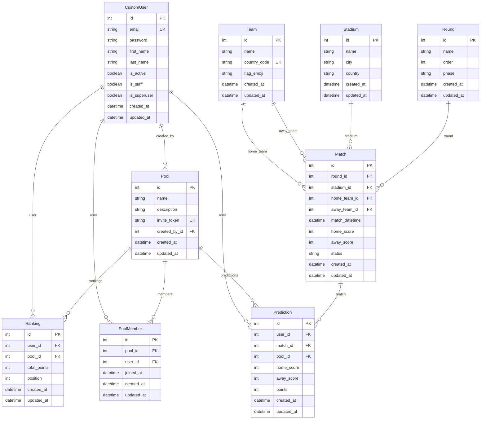

# Database

Banco de dados: **SQLite** (`db.sqlite3` na raiz do projeto).

## Diagrama de entidades



## Regras de integridade

- `PoolMember`: `unique_together = ('pool', 'user')` - um usuario so pode ser membro uma vez por bolao.
- `Prediction`: `unique_together = ('user', 'match', 'pool')` - um usuario so pode ter um palpite por jogo por bolao.
- `Ranking`: `unique_together = ('user', 'pool')` - um usuario so tem um ranking por bolao.
- `Match.home_score` e `Match.away_score` sao `null=True, blank=True` - so recebem valor quando o jogo eh finalizado.

## Campo audit em todos os modelos

Todo modelo possui os campos:

```python
created_at = models.DateTimeField(auto_now_add=True)
updated_at = models.DateTimeField(auto_now=True)
```

Nenhuma excecao.

## Migrations

Comando para criar e aplicar migracoes:

```bash
python manage.py makemigrations <app>
python manage.py migrate
```

Sempre rodar `makemigrations` e `migrate` apos criar ou alterar modelos.